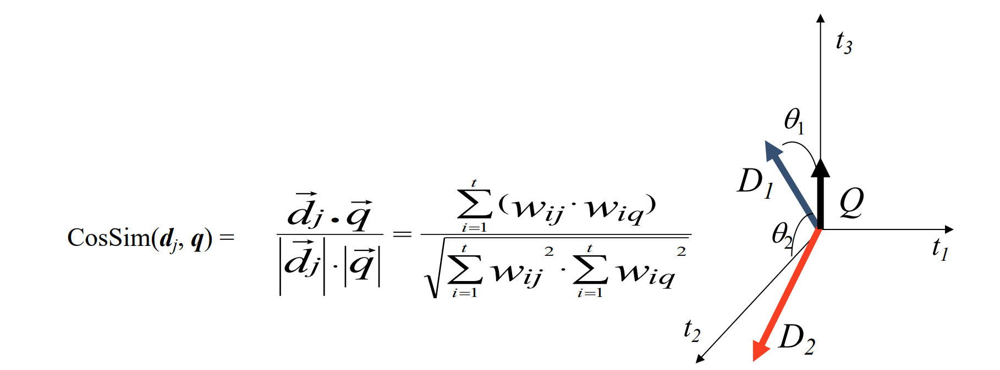

# IR-final-project
## Authors: 
Amit Chen, Omer Hanan.

---
## Summary:
Ben Gurion University, Software and Information Systems Engineering, Information retrieval course - final project.
This project is about creating a search engine to the entire Wikipedia corpus, above 6,300,000 documents (!).
We used all course's theory in order to develop our search engine:

1. <b>Preprocessed the data- </b>
    - ***Parsing*** 
    - ***Tokenization***
    - ***remove stopwords***
    - ***Stemming***
    - Separated every page to 5 ***components:*** title, body, anchor text, page rank, page view.
    - created ***Inverted Index*** to Each component.

2. <b>Query Expansion-</b> After trying GloVe (Global Vectors for Word Representation), Word2Vec and WordNet, we decided to use WordNet to perform Query Expansion since this is the fastest approach and it gives pretty good ampiric results. We used 1 best sysnonym and 1 best hypernym (if exists) to every word.</br> For example- searching for tokenized query ["Marijuana"] will expand to ["Marijuana","Cannabis"].

3. <b>Search</b> throught the data. After preprocessing the data we used a simularity measures to determine the simularity between a given query to the engine and a candidate document, using the inverted index. Each document component have it own ranking method, depend on the component content and values.
    - ***Title:*** binary ranking method.
    - ***Body:*** BM25 simularity measure, with tested K and b values (different from the calculation performed in the `search_body` route which using CosineSimularity measure).
    - ***Anchor:*** calculation for anchor rank (different from he calculation performed in the `search_anchor` route, where it is binary).
    - ***PageRank:*** calculation for page authority.
    - ***PageView:*** calculation for page popularity.

4. <b>Evaluation-</b> The course staff provide us with labled benchmark as test dataset for tesing and evaluation. The evaluation metrics we used are:
    - ***Precision:*** number of relevant documents for given query that retrived, divide by number of retrived documents.
    - ***Recall:*** number of relevant documents for given query that retrived, divide by all relevant documents.
    - ***Map@40:*** # Add explain about Map@40.

 ---
## Data structures:
We used the following data structures in order to make the claculations faster:
1. ***DL:*** <Document id, Document length> dictionary that helps us to find the length of the document in O(1) since its preprocessed. Those values are used for example in the BM25 calculation (finding B).
2. ***DT:*** <Document id, Title> Helps us to norm the title values, and in addition, to display the search results in a more informative way. not just document id, but a title also.
3. ***NF:*** <Document id, Normalization factor- vector length> Used in the Cosine Simularity calculation (denomenator can be pre-calculated since its not relying on user's query. retrived in O(1) Time complexity).

And the following Inverted Inexes to achive fast retrieval:
1. Title Inverted Index (stemmed).
2. Body Inverted Index (stemmed).
3. Anchor text Inverted Index (stemmed).
4. PageRank csv (normalized).
5. PageView dictionary (normalized).

---
## System components (API endpoints):
### Serach / main route:
Returns up to a 100 of the best search results for the given query. \
This is the place which we put forward our best search engine, \
We have a free hand to implement it as we like, within the bound of the 
project requirements (efficiency, quality, etc.). \
We ecided to remove stopwords (english stopwords & corpus stopwords), to perform stemming over the corpus, to expand queries with Query Expansion method based on WordNet, create Inverted Indexes to all document component (as described above) and to inspect simularity using BM25 measure with optimal K,b values.
We created a `score` function, that takes the values from the following functions:
1. Title- binary function.
2. Body- BM25 based simularity.
3. Anchor- accumulating function (different from the one will describe at the search_anchor route)
4. PageRank- authority measure of a page.
5. PageView- popularity measure of a page based on views.


</br>

And set weighs to every function. for example: 
> ```Score = ( (A * Title)  + (B * Body) + (C * Anchor) + (D * PageRank) + (E * PageView) )```

For determine the values of A,B,C,D,E we used `scipy` models.

To issue a query navigate to a URL like: \
http://SERVER/search?query=hello+world \
where SERVER is something like XXXX-XX-XX-XX-XX.ngrok.io \
if you're using ngrok on Colab or your external IP on GCP.

### Search_body:
Route instruction: </br>
Returns up to a 100 search results for the query using TFIDF AND COSINE
SIMILARITY OF THE BODY OF ARTICLES ONLY. \
DO NOT use stemming. DO USE tokenizer and remove stopwords. 

</br>
Since the document vector length can be calculated in the preprocess (do not depend on the query), we calculated it, and store the values in `NF dictionary` as described in the ***Data Structures*** part.

### Search title:
Route instruction: </br>
Returns ALL (not just top 100) search results that contain A QUERY WORD 
IN THE TITLE of articles, \
ordered in descending order of the NUMBER OF QUERY WORDS that appear in the title. \
For example, a document with a title that matches two of the query words will be ranked before a document with a title that matches only one query term.

### Search anchor:
Route instruction: </br>
Returns ALL (not just top 100) search results that contain A QUERY WORD 
IN THE ANCHOR TEXT of articles, ordered in descending order of the 
NUMBER OF QUERY WORDS that appear in anchor text linking to the page. 
For example, a document with a anchor text that matches two of the 
query words will be ranked before a document with anchor text that 
matches only one query term. 

### [POST] PageRank (authority value):
Route instruction: </br>
Returns PageRank values for a list of provided wiki article IDs.

### [POST] PageView (views):
Route instruction: </br>
Returns the number of page views that each of the provide wiki articles
had in August 2021.

---

:smiling_imp: